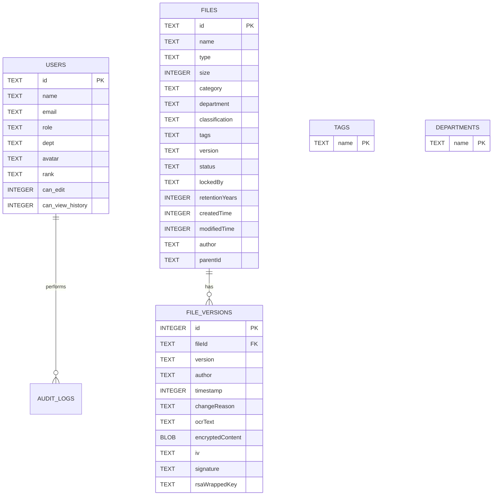

# DocShield — (OHPC) Document Management System

DocShield is a secure, enterprise-grade Document Management System (DMS) custom-built for the **OHPC**. It is designed to securely store, version, and manage critical operational manuals, financial accounts, substation schematics, and public charters.

The application leverages a hybrid cryptography architecture to protect sensitive data at rest and in transit, enforces strict role-based access control, and maintains an immutable ledger for auditing operations.

---

## 📸 Screenshots

Below are the operational views and interfaces of DocShield:


  

  


  


  

  


  

  

  


  

  


  

  

  

  

  

  

  

  

  

---

## 🌟 Core Features


### 🔒 Cryptographic Envelope Protection
* **Hybrid Encryption**: Symmetric payload encryption using AES-256-CBC with dynamic Initialization Vectors (IVs), paired with asymmetric key wrapping using a generated RSA-4096 key pair.
* **Integrity Verification**: HMAC SHA-256 digital signatures are generated and verified for every file transaction to detect and block corrupt or tampered ciphertext.
* **Granular Decryption Control**: Only authenticated users with matching department clearance and role levels can decrypt and view documents.

### 👥 Role-Based Access Control & Dashboards
* **Three Classification Levels**:
  * `PUBLIC`: Fully accessible to visitors without signing in.
  * `INTERNAL`: Available to all authenticated employees and officials.
  * `CONFIDENTIAL`: Restrained to select authorized users with specific rank permissions.
* **Contextual Dashboards**:
  * **System Admin**: Complete management dashboard including audit log inspector, user permission matrices, document uploads, and tag/department management.
  * **Official User**: A tailored, department-specific workspace displaying only relevant documents, personal checkouts, and scoped metrics (e.g. department classification charts) while hiding global audit logs to prevent information leakage.
* **Administrative Controls**: The system administrator can toggle specific capabilities such as `can_edit` and `can_view_history` (which replaces standard approval flow for granular compliance management).

### ⏳ Version Control & Metadata Management
* **Document Versioning**: Track previous document revisions seamlessly. Administrator views render a nested dropdown listing all historical iterations (`v1.0`, `v1.1`, etc.) containing distinct author, timestamp, change reason, and file metadata.
* **Restricted Uploads**: Uploading documents and creating folder paths is restricted exclusively to `SYSTEM_ADMIN` users to preserve compliance integrity.
* **Audit Trail**: Every user action (logins, uploads, decryptions, downloads) is logged automatically in the audit ledger.

---

## 🛠️ Technology Stack

| Component | Technology | Description |
| :--- | :--- | :--- |
| **Frontend** | React, Vite, TypeScript | Modern, high-performance UI styled using custom Vanilla CSS (Curated color tokens, glassmorphism, responsive grids). |
| **Backend** | Node.js, Express, TypeScript | RESTful API server handling authentication, document vault actions, user administration, and cryptographic routines. |
| **Database** | SQLite | Server-side relational database storing records for files, users, versions, tags, departments, and logs. |
| **Security** | JSON Web Tokens (JWT), Crypto | Authenticates requests securely and handles envelope encryption routines via standard Node.js libraries. |

---

## 📁 Project Structure

```
docshield/
├── README.md               # Root comprehensive documentation
├── index.html              # Landing index layout
├── index.css               # Core styling variables and landing CSS
├── app.js                  # Static application script (legacy dashboard mock/reference)
├── client/                 # React Frontend Application
│   ├── src/
│   │   ├── features/       # Feature modules: home, dashboard, repository, admin, profile
│   │   ├── components/     # Reusable layout and notification shells
│   │   ├── context/        # AuthContext and NotificationContext providers
│   │   ├── hooks/          # Custom Router and utility hooks
│   │   └── types/          # TypeScript model definitions
│   └── vite.config.ts      # Vite dev configuration
└── server/                 # Express Backend API Server
    ├── src/
    │   ├── database/       # Migrations and SQLite seed data script
    │   ├── controllers/    # Request handlers: Auth, Document, Admin, Audit
    │   ├── middleware/     # JWT verification and role validators
    │   ├── models/         # User, File, Version, and Audit schema models
    │   └── services/       # Cryptographic envelope utilities
    └── tsconfig.json       # Backend TypeScript config
```

---

## 🗄️ Relational Database Schema



---

## ⚡ Setup & Installation

### Prerequisites
* [Node.js](https://nodejs.org/) (v18 or higher recommended)
* npm (package manager)

### 1. Backend Server Configuration
1. Navigate to the `server` directory:
   ```bash
   cd server
   ```
2. Install the server dependencies:
   ```bash
   npm install
   ```
3. Set up the environment variables:
   * Create a `.env` file based on `.env.example` (or configure port and secret settings):
   ```env
   PORT=5001
   JWT_SECRET=ohpc_jwt_secure_2026_key_vector
   ```
4. Start the backend development server (automatically runs migrations and seeds database):
   ```bash
   npm run dev
   ```
   *The server will initialize on [http://localhost:5001](http://localhost:5001).*

### 2. Frontend Client Configuration
1. Open a new terminal and navigate to the `client` directory:
   ```bash
   cd client
   ```
2. Install the client dependencies:
   ```bash
   npm install
   ```
3. Boot up the Vite dev server:
   ```bash
   npm run dev
   ```
   *The client application will start on [http://localhost:5173](http://localhost:5173).*

---

## 💻 Demo Accounts

For local evaluation, you can authenticate into the workspaces using the following seeded configurations inside the Sign In page:

| Username / Email | Role | Clearance / Department | Default Capabilities |
| :--- | :--- | :--- | :--- |
| **admin@ohpc.gov.in** | System Admin | IT | Upload files, Manage Users permissions, Admin tags/depts, View version history |
| **sasmita.d@ohpc.gov.in** | Official | Generation | View Department Documents, Check out files, View version history (if enabled) |
| **ranjan.p@ohpc.gov.in** | Official | Finance | View Department Documents, View version history (if enabled) |
| **Guest Access** | Anonymous | Public | Browse `PUBLIC` classification files without logging in |
